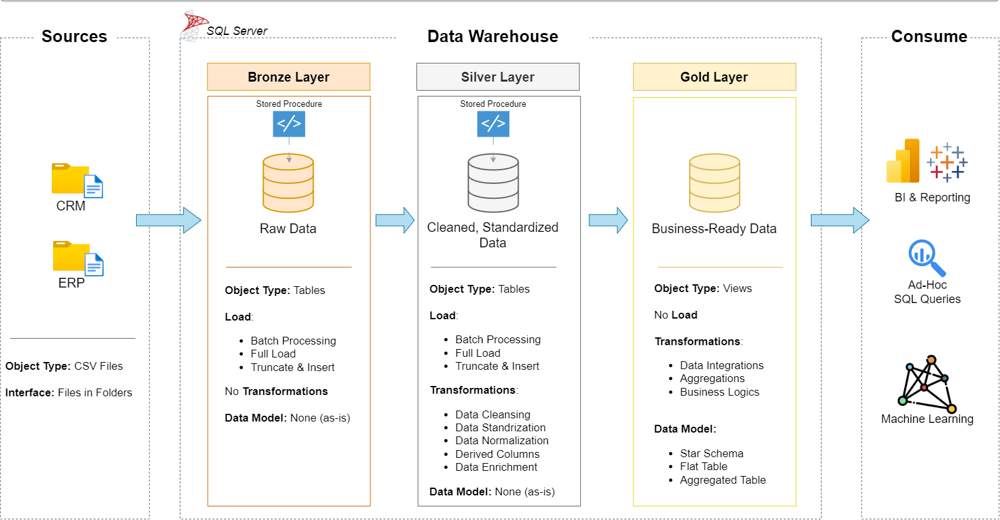

# SQL-data-warehouse-design
Building a modern data warehouse with PostgreSQL, including ETL processes, data modeling and analytics

# 🏬 Enterprise Retail Data Warehouse with Medallion Architecture (PostgreSQL)

Welcome to the **Enterprise Retail Data Warehouse** project! 🚀  
This is a portfolio-level data engineering project that demonstrates how to build a **modern data warehouse** using **PostgreSQL** and **Medallion Architecture (Bronze → Silver → Gold)**, supporting full data pipeline development from ingestion to insights.

---

## 📐 Architecture Overview

  

This solution follows the **Medallion Architecture** pattern:

- **Bronze Layer**: Raw data ingestion from source systems (CSV format).
- **Silver Layer**: Cleaned, standardized, and enriched data.
- **Gold Layer**: Analytics-ready data modeled as a **Star Schema**.

Each layer uses **PostgreSQL** DDL/DML scripts with batch processing (`TRUNCATE & INSERT` pattern) and versioned SQL in Git.

---

## 🔁 High-Level Data Flow

- Data flows from CRM and ERP CSVs into PostgreSQL's **Bronze** layer.
- **Stored procedures** (SQL scripts) load and cleanse data in **Silver**.
- Gold layer applies **business logic** and **modeling (Star Schema)** for reporting.

---

## 🔧 Tools & Technologies

- **Database**: PostgreSQL
- **Interface**: pgAdmin / DBeaver
- **ETL**: SQL Scripts (DDL + DML)
- **Version Control**: Git + GitHub
- **Diagramming**: Draw.io (Visual Architecture & ERD)
- **Docs/Planning**: Notion
- **BI Ready**: Compatible with Power BI, Tableau

---

## 🧩 Data Sources

- **ERP System**: Product categories, customer metadata
- **CRM System**: Sales orders, customer profiles, product information

Both are provided in `.csv` format and stored in the `/datasets` folder.

---

## 🛠️ Layered Implementation

### 🟫 Bronze Layer (Raw Data)

> **Objective**: Load raw, unmodified CSV data into PostgreSQL for traceability

**Object Type**: Tables  
**Load Method**: Full Load (`TRUNCATE & INSERT`)  
**Transformations**: None (as-is)

**SQL Script Directory**:  
🔗 [`/scripts/silver`](https://github.com/er-ganeshgautam/Enterprise-Retail-Data-Warehouse-with-Medallion-Architecture/tree/main/scripts/bronze)

---

## 🪙 Silver Layer – Cleansed & Standardized

> **Objective**: Clean and normalize raw data to make it suitable for integration and analytics.

**Object Type**: `Tables`  
**Load Method**: `Full Load` using `TRUNCATE & INSERT` strategy  
**Transformations Applied**:
- ✅ Data cleansing – remove nulls, trim whitespace, drop duplicates  
- 🔤 Standardization – normalize naming conventions, format consistency  
- 🧱 Normalization – decompose fields, join across tables  
- 🧮 Derived columns – calculate additional values for clarity  
- 🌍 Enrichment – resolve reference values (e.g., country from location codes)

**SQL Script Directory**:  
🔗 [`/scripts/silver`](https://github.com/er-ganeshgautam/Enterprise-Retail-Data-Warehouse-with-Medallion-Architecture/tree/main/scripts/silver)

---

## ⭐ Gold Layer – Business-Ready Data
 
> **Objective**: Build dimensional models and star schema optimized for business intelligence and reporting.

**Object Type**: `Views` / `Final Tables`  
**Load Method**: No direct file load — populated using `INSERT INTO ... SELECT` from Silver Layer  
**Transformations Applied**:
- 🔗 Data Integration – join CRM & ERP tables into unified dimensions  
- 📊 Aggregations – monthly summaries, calculated KPIs  
- 🧠 Business Logic – profit margin calculations, mapping product lines  
- 🧩 Data Modeling – implement **Star Schema** using:
  - `fact_sales`
  - `dim_customers`
  - `dim_products`

**SQL Script Directory**:  
🔗 [`/scripts/gold`](https://github.com/er-ganeshgautam/Enterprise-Retail-Data-Warehouse-with-Medallion-Architecture/tree/main/scripts/gold)

